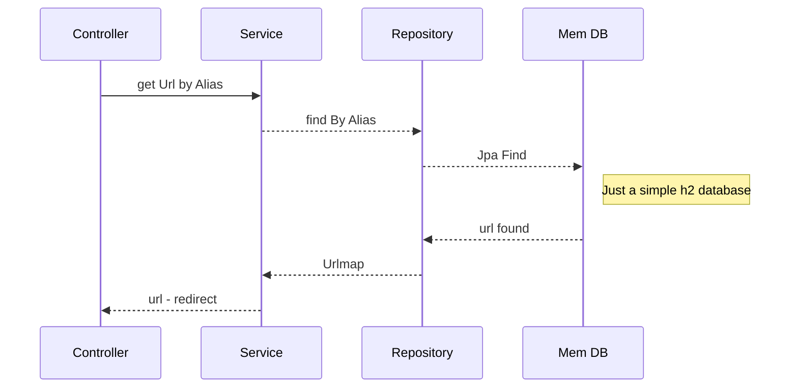
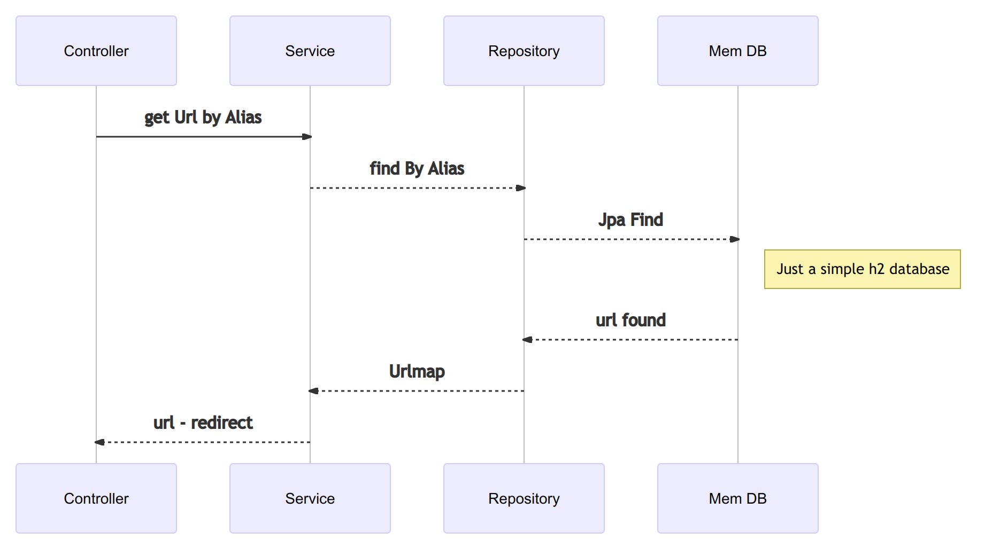
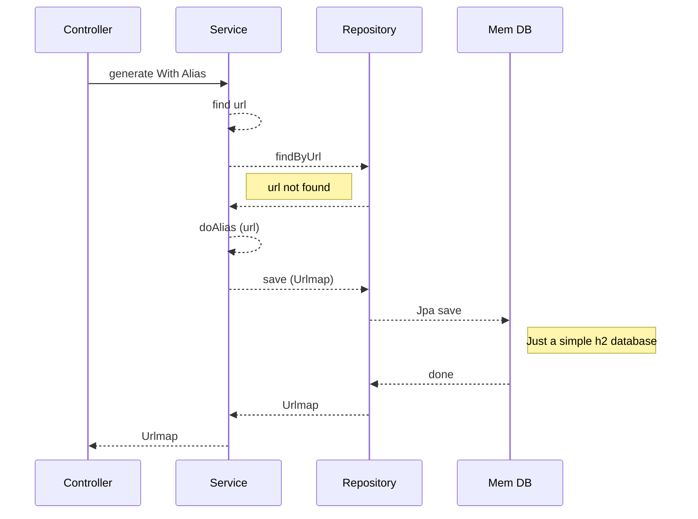
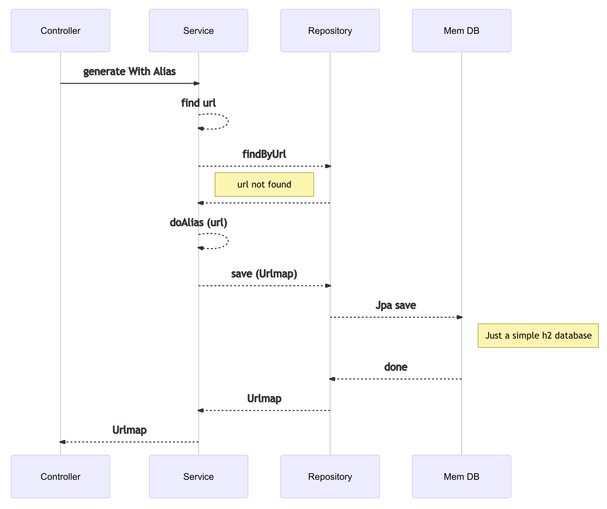

# Just a simple URL shortener in Java

> POST: to http:localhost with the json data
> {“url”:”www.google.maps.com”} returns “alias”:”BdfGT”
> 
> GET “http:localhost/BdfGT” redirect to “www.google.maps.com"

  

## Rules:
The rules are ...

    Handle duplicate entries
    
    - 2 equal URLs should have the same alias, but such alias can be different if server is restarted.
    
    Any url containing “google”:
    
    - alias will have 5 characters length
    
    - alias will use only alpha characters
    
    Any url containing “yahoo”
    
    - alias will have 7 characters length
    
    - alias will use alphanumeric characters
    
    Any other url
    
    - alias will be based on the url itself by removing every special characters, vowels and numbers from it.
 

## Proces diagrams

### Retrieving  process

### Creation process

### requirements 
- maven
- java 

## Run and Test 

      git clone git@github.com:j3sux/just-a-shortener.git
      cd just-a-shortener.git
      mvn spring-boot:run

## Examples

### Google
Create Alias 

      curl --location --request POST 'http://localhost:8080/' --header 'Content-Type: application/json' --data-raw '{"url":"https://news.google.com/search?q=java&hl=es-419&gl=MX&ceid=MX%3Aes-419"}'

Retrive url by alias

    curl --location --request GET 'http://localhost:8080/fdacac'

### Yahoo
Create Alias 

      curl --location --request POST 'http://localhost:8080/' --header 'Content-Type: application/json' --data-raw '{"url":"https://login.yahoo.com"}'

Retrive url by alias

    curl --location --request GET 'http://localhost:8080/fb529f3'

### nearsoft

Create Alias

    curl --location --request POST 'http://localhost:8080/' --header 'Content-Type: application/json' --data-raw '{"url":"https://nearsoft.com/about/"}'

Retrive url by alias

    curl --location --request GET 'http://localhost:8080/httpsnrsftcmbt'
